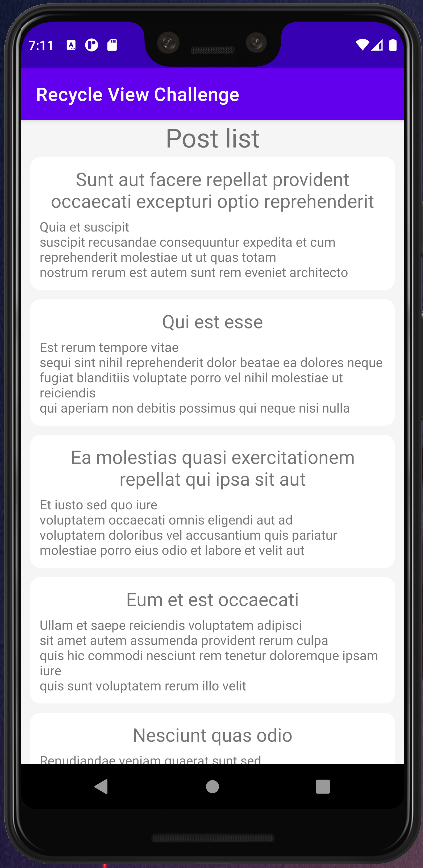
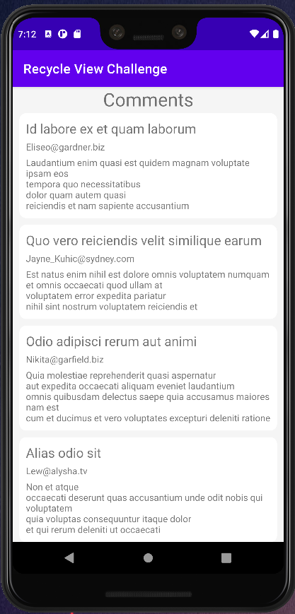
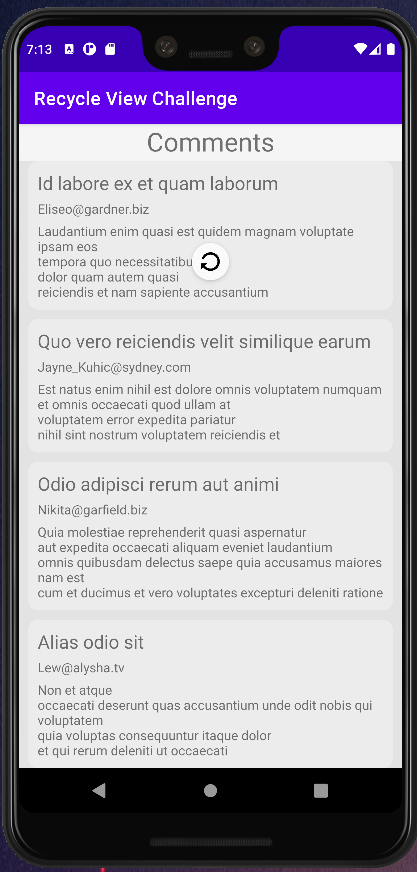

# Music Player
In this project, a posts application that retrieves information from API and stores the information in the database checking if the retrieved item id already exists or not.
Finally the app shows a list of clickable posts that delivers the user to a another fragment with the comments related to selected post with details.

## Screenshots

## Built With

### Languages
- 

### Build tools
- 

### Platform
- 

### Editors
- 

### Version controlers
- 
- 

## Dependencies used
### Databases
- Room

### Networking and parsing
- Retrofit
- Moshi

### API endpoint 
- https://jsonplaceholder.typicode.com/

## Getting Started

### Installation

1. Clone the repo

   git clone https://github.com/hunter4466/recycle_view_challenge.git

2. Open Android Studio

   cd ...~/recycle_view_challenge

3. Debug

   Open up you preferred emulator or android device.

### Assumptions

- Added some extra features to the main requirements as play next song, an infinite loop of songs from the last to the first one.

## Author

👤 **Mario Chois**
(Click the linked badges below)
- 
- 
- 

## 🤝 Contributing

Contributions, issues, and feature requests are welcome!

Feel free to check the [issues page](https://github.com/hunter4466/recycle_view_challenge/issues).

## Show your support

Give a ⭐️ if you like this project!

## 📝 License

This project is [MIT](./LICENSE) licensed.
